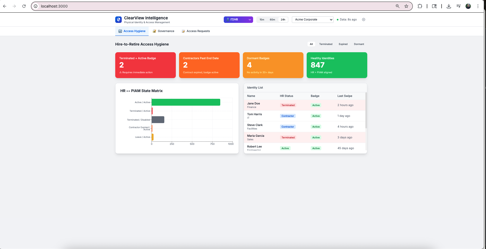

# ClearView Intelligence

**Unified Physical Security Intelligence for the Modern Enterprise**


---

### Why This Exists

Modern enterprises run 3-6 different Physical Access Control Systems across their facilities. Security teams waste hours switching between Lenel, C-CURE, S2, and Genetec consoles. Auditors demand evidence chains. Deny spikes go unnoticed. Terminated employees keep their badges.

**ClearView Intelligence solves this.** One dashboard. All PACS. Real-time analytics. Complete audit trails.

---

## Quick Navigation for Reviewers

| Resource | Description |
|----------|-------------|
| [Demo Guide](docs/demo/README.md) | 15-minute presentation flow |
| [Architecture Deep-Dive](docs/ARCHITECTURE.md) | Technical documentation |
| [Interactive Diagram](backup-site/public/architecture.html) | Visual architecture presentation |

---

## Architecture Overview

```
+==================================================================================+
|                         ClearView Intelligence Platform                           |
+==================================================================================+

                            PACS CONNECTOR LAYER
    +-------------+    +-------------+    +-------------+    +-------------+
    |   Lenel     |    |   C-CURE    |    |     S2      |    |  Genetec    |
    | OnGuard     |    |   9000      |    |  NetBox     |    |  Synergis   |
    +------+------+    +------+------+    +------+------+    +------+------+
           |                  |                  |                  |
           +------------------+------------------+------------------+
                                      |
                              [Event Ingestion]
                                      v
+==================================================================================+
|                        CLICKHOUSE OLAP DATABASE                                   |
|----------------------------------------------------------------------------------|
|  Dimension Tables     |  Fact Tables           |  Materialized Views             |
|  - dim_tenant         |  - fact_access_events  |  - v_kpi_current (15s)          |
|  - dim_site           |  - fact_connector_health|  - v_timeseries_minute (15s)    |
|  - dim_person         |  - fact_compliance     |  - v_door_hotspots (30s)        |
|  - dim_entitlement    |                        |  - v_recent_events (5s)         |
+==================================================================================+
                                      |
                              [HTTP REST API]
                                      v
+==================================================================================+
|                     NEXT.JS API LAYER (/api/clickhouse)                          |
+==================================================================================+
                                      |
                              [React Hooks]
                              useClickHouse()
                              Auto-refresh
                                      v
+==================================================================================+
|                        REACT FRONTEND                                            |
|----------------------------------------------------------------------------------|
|  KPICard | TimeSeriesChart | MapView | EventsTable | EvidenceDrawer             |
|  GovernanceView | ComplianceView | MusteringView | GenAIView                    |
+==================================================================================+
```

[View the full interactive architecture diagram](backup-site/public/architecture.html)

---

## Key Features

| Feature | Description |
|---------|-------------|
| **Multi-PACS Aggregation** | Unified view across Lenel, C-CURE, S2, Genetec, HID, and Verkada |
| **Real-Time Analytics** | Live event streaming with sub-second deny spike detection |
| **Audit Evidence Chain** | Click-through from aggregate metrics to raw PACS payloads |
| **Entitlement Governance** | Full visibility into who has access, why, and who approved it |
| **Contractor Compliance** | Track safety training, background checks, and site inductions |
| **Emergency Mustering** | Real-time personnel accountability during evacuations |
| **AI Dashboard Builder** | Natural language dashboard generation powered by GPT-4 |

---

## Screenshots

<table>
<tr>
<td></td>
<td></td>
</tr>
<tr>
<td align="center"><em>Dashboard Overview</em></td>
<td align="center"><em>Command Center</em></td>
</tr>
</table>

---

## Getting Started

```bash
# Clone the repository
git clone <repo-url>
cd piam-dashboard

# Full setup in one command (starts ClickHouse, loads data, runs frontend)
make quickstart

# Open the dashboard
open http://localhost:3000
```

**That's it.** The dashboard will be live with synthetic data.

### Manual Setup

```bash
# Install dependencies
npm install

# Start development server
npm run dev

# Build for production
npm run build
```

---

## Tech Stack

| Layer | Technology | Purpose |
|-------|------------|---------|
| **Frontend** | Next.js 14 (App Router) | React framework with server components |
| **Language** | TypeScript | Type-safe development |
| **Styling** | Tailwind CSS | Utility-first CSS |
| **Charts** | Recharts | Data visualization |
| **Maps** | Mapbox GL | Geospatial visualization |
| **Database** | ClickHouse | Column-oriented OLAP for real-time analytics |
| **AI** | OpenAI GPT-4 | Natural language dashboard generation |

---

## Demo Flow (15 Minutes)

| Time | Section | Key Highlights |
|------|---------|----------------|
| 0-3 min | **Command Center** | Real-time KPIs, deny spike detection, multi-PACS visibility |
| 3-5 min | **Drilldown** | Click event row, show evidence drawer with raw PACS payload |
| 5-8 min | **Governance** | Entitlement visibility, approval chains, expiring access |
| 8-11 min | **Compliance** | Contractor audit dashboard, one-click CSV export |
| 11-13 min | **Mustering** | Emergency response, personnel accountability |
| 13-15 min | **AI Builder** | "Create a PIAM dashboard" - GenAI moment |

See the [full presenter's guide](docs/demo/README.md) for talking points and demo actions.

---

## Multi-Tenant Scenarios

Switch between demo tenants to showcase different use cases:

| Tenant | Scenario | Characteristics |
|--------|----------|-----------------|
| **Acme Corporate** | Office complex | Lower deny rates (~2.5%), stable operations |
| **BuildRight Construction** | Active job site | Higher compliance issues, contractor-heavy |

---

## Common Commands

```bash
make quickstart    # Full setup: ClickHouse + data + frontend
make up            # Start ClickHouse + Superset only
make generate      # Generate synthetic PACS data
make trickle       # Start live event stream
make shell-ch      # ClickHouse CLI
make health        # Check service status
make logs          # View container logs
```

---

## Documentation

- [Architecture Guide](docs/ARCHITECTURE.md) - Complete technical deep-dive
- [Demo Guide](docs/demo/README.md) - Presenter's guide with talking points
- [Interactive Diagram](backup-site/public/architecture.html) - Visual architecture walkthrough

---

## License

MIT License - See LICENSE file for details.

---

<p align="center">
<strong>ClearView Intelligence</strong><br/>
<em>Strength of Simplicity</em>
</p>
